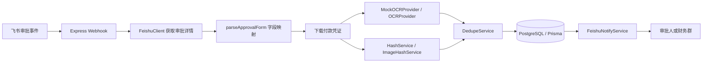

# 飞书报销审批辅助审核机器人

这是一个最小可用版本的飞书报销审批辅助审核服务。它只做 OCR、金额核对、历史凭证查重和风险提示，不会自动通过、拒绝、转交或撤销任何审批。

## 架构



## 本地启动

```bash
npm install
cp .env.example .env
npx prisma generate
npx prisma migrate dev --name init
npm run dev
```

服务默认监听 `http://localhost:7319`，健康检查为 `GET /healthz`，飞书事件 URL 为：

```text
POST /webhooks/feishu/approval
```

## 环境变量

| 变量 | 说明 |
| --- | --- |
| `DATABASE_URL` | PostgreSQL 连接串 |
| `FEISHU_APP_ID` / `FEISHU_APP_SECRET` | 飞书企业自建应用凭据 |
| `FEISHU_VERIFICATION_TOKEN` | 事件订阅 verification token |
| `FEISHU_ENCRYPT_KEY` | 事件加密密钥；MVP 已预留入口，尚未实现解密 |
| `FEISHU_NOTIFY_RECEIVE_ID_TYPE` | `open_id`、`user_id` 或 `chat_id` |
| `FEISHU_NOTIFY_RECEIVE_ID` | 机器人消息接收人或群 ID |
| `APPROVAL_AMOUNT_FIELD_NAMES` | 金额字段候选名称，逗号分隔 |
| `APPROVAL_ATTACHMENT_FIELD_NAMES` | 凭证/截图字段候选名称，逗号分隔 |
| `APPROVAL_APPLICANT_FIELD_NAMES` | 申请人/报销人字段候选名称，逗号分隔 |
| `LOCAL_STORAGE_DIR` | 本地凭证保存目录；后续可替换为 S3 Provider |
| `SAVE_ORIGINAL_FILE` | 是否保存原始付款凭证 |
| `SAVE_OCR_RAW_TEXT` | 是否保存 OCR 原文 |
| `PERCEPTUAL_HASH_DISTANCE_THRESHOLD` | 图片感知 hash 判重阈值 |

## 飞书开放平台配置

1. 创建企业自建应用。
2. 开启机器人能力。
3. 配置事件订阅 URL：`https://你的域名/webhooks/feishu/approval`。
4. 订阅审批实例状态变更事件。
5. 申请读取审批实例、审批相关文件、发送消息所需权限。
6. 发布并安装应用到企业。
7. 将事件订阅里的 verification token 写入 `.env`。

`FeishuClient` 已集中封装 tenant access token、审批实例读取、附件下载和机器人消息发送。不同审批控件返回的附件结构可能不同，真实上线前需要用实际审批实例 payload 校准 `parseApprovalForm.ts` 中的附件适配逻辑。

## 审批字段映射

审批表单字段通过名称匹配：

```env
APPROVAL_AMOUNT_FIELD_NAMES=报销金额,金额,实付金额
APPROVAL_ATTACHMENT_FIELD_NAMES=付款凭证,支付截图,报销凭证,附件
APPROVAL_APPLICANT_FIELD_NAMES=申请人,报销人
```

如果字段解析失败，系统会把 audit run 标记为 `SUCCESS_WITH_WARNING`，并向财务群发送“需要人工处理”的提示，避免飞书 webhook 反复重试。

## OCR Provider 替换

当前默认实现是 `MockOCRProvider`，会从文件名和文本型 fixture 中提取金额、交易号、付款时间、收款方。替换真实 OCR 时，实现 `OCRProvider` 接口即可：

```ts
recognizePaymentEvidence(input: {
  fileBuffer: Buffer;
  fileName: string;
  mimeType?: string;
}): Promise<{
  rawText: string;
  amount?: string;
  transactionId?: string;
  paidAt?: string;
  payee?: string;
  confidence: number;
}>;
```

可替换为火山引擎、百度 OCR、腾讯云 OCR、阿里云 OCR 或自建 OCR 服务。OCR 不可靠，通知里始终标注“仅供辅助审核”。

### 使用 AI 视觉模型识别付款截图

项目已内置通用 `AIVisionOCRProvider`。开启后会把图片型付款凭证发送给视觉模型，并按现有 `OCRProvider` 接口返回金额、交易号、付款时间、收款方和置信度；非图片附件会继续使用文本 fallback，避免阻塞主流程。

OpenAI Responses API 示例：

```env
OCR_PROVIDER=openai
AI_VISION_API_KEY=sk-...
AI_VISION_BASE_URL=https://api.openai.com
AI_VISION_MODEL=gpt-4o-mini
AI_VISION_API_STYLE=responses
```

OpenAI-compatible Chat Completions 视觉模型示例：

```env
OCR_PROVIDER=openai-compatible
AI_VISION_API_KEY=你的模型服务密钥
AI_VISION_BASE_URL=https://你的模型服务地址
AI_VISION_MODEL=你的视觉模型名称
AI_VISION_API_STYLE=chat_completions
```

生产使用时建议：

- 不保存完整 OCR 原文，保持 `SAVE_OCR_RAW_TEXT=false`。
- AI 识别结果只作为辅助，金额和交易流水号仍需人工复核。
- 如果公司有数据合规要求，先确认付款截图、银行卡尾号、交易流水号是否允许发送到第三方模型服务。

## 查重规则

风险等级：

| 规则 | 风险 |
| --- | --- |
| 原始文件 SHA-256 完全一致 | HIGH |
| 交易流水号非空且完全一致 | HIGH |
| 图片感知 hash 距离小于阈值 | HIGH 或 MEDIUM |
| 金额 + 付款日期 + 收款方一致 | MEDIUM |
| 金额不一致 | 至少 MEDIUM |
| OCR 未识别金额、字段缺失、附件读取失败 | UNKNOWN |

只有金额相同不算重复，不会提高风险等级。

## 数据库

Prisma schema 包含：

| 表 | 用途 |
| --- | --- |
| `approval_audit_runs` | webhook 幂等与处理状态 |
| `payment_evidences` | 付款凭证、OCR、hash、风险结果 |
| `duplicate_matches` | 当前凭证与历史凭证的重复匹配明细 |

初始化：

```bash
npx prisma generate
npx prisma migrate dev --name init
```

## 安全与合规

所有密钥、数据库密码和飞书配置都来自环境变量。日志配置会避免打印完整 OCR 原文、付款凭证文件内容、`app_secret` 和 `tenant_access_token`。保存凭证时使用不可预测 `storageKey`，不会直接用原文件名作为路径。

付款凭证可能包含个人敏感信息、银行卡尾号、交易流水号。企业上线时应根据合规要求配置访问权限、加密、留存期限、删除策略和审计日志。

## 当前限制

- 不自动审批、不自动拒绝。
- OCR 可能误判，金额和交易号必须人工复核。
- 附件字段结构需要按真实飞书审批表单适配。
- 图片感知 hash 使用 `sharp` 生成 8x8 灰度 average hash，对大幅裁剪、重绘或复杂压缩不一定可靠。
- 飞书加密回调已预留入口，MVP 尚未实现解密。

## 后续增强

- 接入真实 OCR。
- 使用飞书消息卡片展示风险明细并支持交互。
- 增加财务后台页面。
- 人工确认结果回写数据库。
- 风险规则可视化配置。
- S3 兼容对象存储 Provider。

## 测试

```bash
npm test
```

已覆盖金额解析、OCR fallback、审批表单解析、SHA-256 查重、交易号查重、金额不一致风险、webhook challenge 和 webhook 幂等入口。
