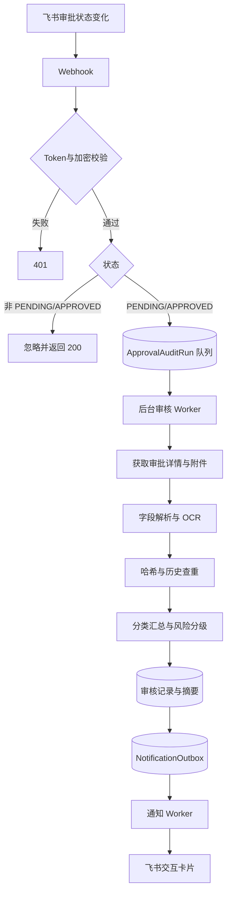

# 业务流程与状态

## 总体数据流

## PENDING 阶段

1. Webhook 调用任务服务，`saveFiles=false`。
2. Worker 获取审批详情、下载附件并执行 OCR 与查重。
3. 将 OCR 和风险结果写入数据库。
4. 默认不保存附件原件，即 `storageKey` 为空。
5. 通知固定目标、提交人和当前待审批人；非低风险申请人也会被通知。

PENDING 阶段的价值是尽早提示审批人，同时把 OCR 结果缓存下来。

## APPROVED 阶段

1. Webhook 调用任务服务，`saveFiles=true`。
2. 如果已经发送过 APPROVED 通知，则跳过。
3. 如果已有 PENDING 阶段证据，优先复用 OCR 结果。
4. 根据配置保存原件，并补写 `storageKey`。
5. 结果发送给表单中的办理人，以及通知路由命中的其他目标。
6. 审核结果成功发送或写入 Outbox 后即写入 `approvedNotifiedAt`，保证流程在通过阶段封口；其他附属 warning 不会导致办结事件重新审核。

## 任务状态

`ApprovalAuditRun.status`：

| 状态 | 含义 |
|---|---|
| `QUEUED` | 等待 Worker 处理 |
| `PROCESSING` | 已被某个 Worker 租约领取 |
| `SUCCESS` | 审核与通知入队成功 |
| `SUCCESS_WITH_WARNING` | 审核完成，但字段或通知存在可人工处理的问题 |
| `FAILED` | 非业务错误，重试耗尽或处理失败 |

Worker 使用 `leaseUntil` 和 `leaseOwner` 防止并发重复领取；过期租约可被其他 Worker 恢复。

## 重试策略

- 审核任务：最多 `AUDIT_JOB_MAX_RETRIES` 次。
- 延迟：约 `1000 × 2^重试次数` 毫秒，最大 60 秒。
- Outbox 通知：发送失败后 30 秒再试，并记录 `retryCount` 和 `lastError`。
- Webhook 对多数内部错误仍返回 200，避免飞书反复投递；token 错误返回 401。

## 幂等设计

- 每个 `instanceCode` 只有一条审核任务记录。
- `PaymentEvidence` 对 `instanceCode + sha256` 和 `instanceCode + fileToken` 建唯一约束。
- 重复匹配记录有联合唯一约束。
- 每条通知使用 `dedupeKey`，Outbox 通过 upsert 避免重复入队。
- `approvedNotifiedAt` 防止 APPROVED 通知重复发送。
